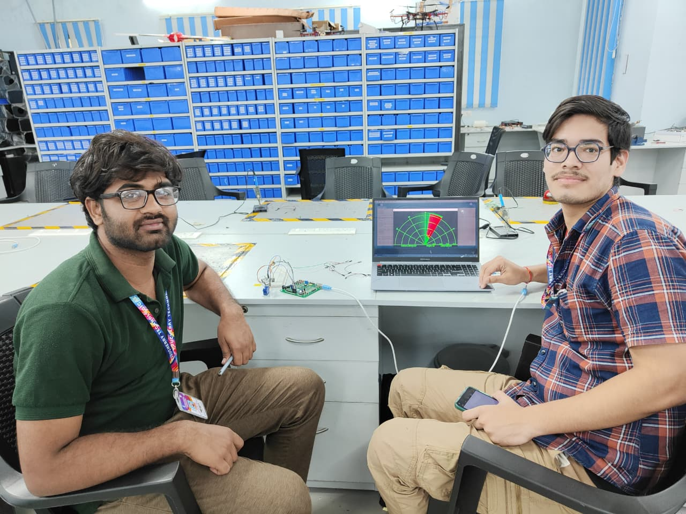

<h1 align="center">Hi 👋, I'm Shivam Kumar</h1>
<h3 align="center">A passionate Android Developer | B.Tech Mechatronics | Tech Explorer</h3>

  

---

### 🚀 About Me
- 🔗 My Portfolio Link: [Business-Site](https://github.com/ShivamKumarPTU/Business-Site)
- 🎓 I'm a 3rd year B.Tech Mechatronics student from Pondicherry
- 💡 Created a **Full Screen Timer App** 
- ⚙️ Working on **GymSaathi App** (helps users analyse their workout through graphs and charts)
- 🤖 Built a chatbot using **Botpress**: [Try it here](https://cdn.botpress.cloud/webchat/v2/shareable.html?botId=a0b423ee-27e1-4257-84f5-eee99d2e6ee3)
- ✨ Dream: Build a SaaS Startup

---

### 🛠️ Tech Stack
- 📱 **Android Development**: `Kotlin`, `Java`, `Jetpack Compose`, `XML`, `MVVM`, `Room`, `WorkManager`, `Geofencing`, `Firebase`
- 🔧 **Tools**: `Android Studio`, `Git`, `GitHub`, `Postman`, `Figma`, `Firebase Console`
- 🌐 **Backend & APIs**: `Retrofit`, `REST APIs`, `Firebase Auth`, `Firestore`, `FCM`
- 🤖 **AI Bots**: `Botpress`
- ⚙️ **Hardware**: `Arduino Uno`, `Servo`, `Ultrasonic Sensor`, `Embedded C`
- 📚 **Practicing**: `Data Structures`, `Algorithms`, `OOPs`, `Design Patterns`

---

### 🧩 Featured Projects

<table>
  <tr>
    <td width="50%">
      <h3>📍 GeoFence Tracker App</h3>
      
Android app that tracks user location and sends notifications upon entering/exiting predefined geofences using Google Maps API.

      

        
        
        
        
        
      

      <a href="https://github.com/ShivamKumarPTU/geofence-tracker">🔗 View Details →</a>
    </td>
    <td width="50%">
      <h3>⏳ Full Screen Timer App</h3>
      
Full-screen timer app with multiple modes, custom intervals, and a distraction-free interface.

      

        
        
        
        
      

      <a href="https://github.com/ShivamKumarPTU/full-screen-timer">🔗 View Details →</a>
    </td>
  </tr>
  <tr>
    <td width="50%">
      <h3>📡 Radar System Project</h3>
      
Arduino-based radar system using ultrasonic sensors to detect objects and visualize distance in real time across a 180° scanning range.

      

        
        
        
        
      

      

        
        
      

      <a href="https://github.com/ShivamKumarPTU/radar-system">🔗 View Details →</a>
    </td>
    <td width="50%">
      <h3>💪 GymSaathi App</h3>
      
Fitness app with Firebase authentication & biometric login, workout tracking, and progress analytics.

      

        
        
        
        
      

      <a href="https://github.com/ShivamKumarPTU/gymsaathi">🔗 View Details →</a>
    </td>
  </tr>
  <tr>
    <td width="50%" colspan="2">
      <h3>⚡ Additional Project: Botpress Chatbot</h3>
      
Interactive chatbot built with Botpress, embedded in a web app for automated conversations.

      

        
        
        
      

      <a href="https://github.com/ShivamKumarPTU/botpress-chatbot">🔗 View Details →</a>
    </td>
  </tr>
</table>

---

### 💼 Services Offered
- **Custom Android App Development** – Full-cycle development using Kotlin and Firebase with fast UI and scalable backend.  
- **App Maintenance & Optimization** – Improve app performance, fix bugs, and enhance user experience.  
- **Firebase Integration** – Set up Authentication, Firestore, Analytics, and Push Notifications.  
- **UI/UX to App Conversion** – Convert your design (Figma/Adobe XD) into a working Kotlin app.

📬 **Let's bring your app idea to life** — [Request a Quote](mailto:your-email@example.com)

---

### 🌐 Connect with Me

---

✨ “Consistency beats talent when talent doesn’t show up.†✨

