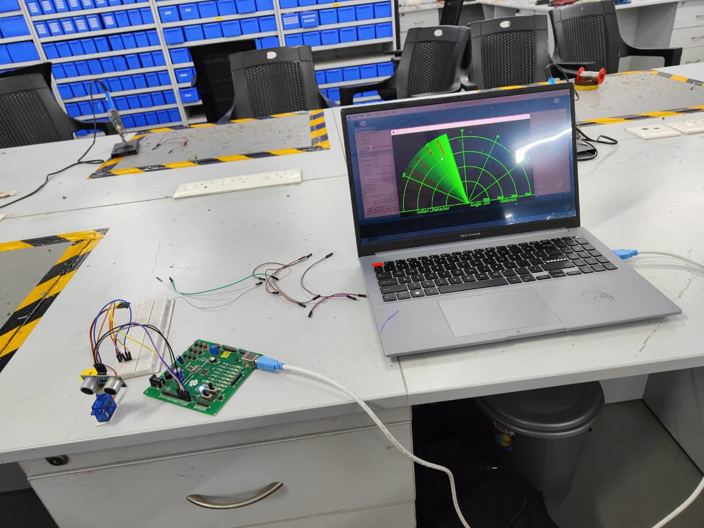
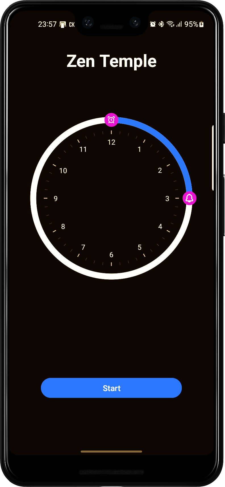
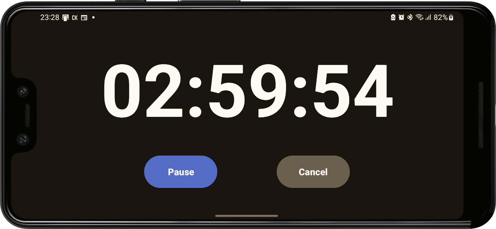

<h1 align="center">Hi 👋, I'm Shivam Kumar</h1>
<h3 align="center">A passionate Android Developer | B.Tech Mechatronics | Tech Explorer</h3>

  

---

### 🚀 About Me

- 🎓 I'm a 3rd year B.Tech Mechatronics student from Pondicherry
- 💡 Created a Full Screen Timer App 
- ⚙️ Working on GymSaathi App(It helps user to analyse their workout through graph and charts)
- 🤖 Built a chatbot using **Botpress**: [Try it here](https://cdn.botpress.cloud/webchat/v2/shareable.html?botId=a0b423ee-27e1-4257-84f5-eee99d2e6ee3)
- ✨ Dream: Build a SaaS Startup
---

### 🛠️ Tech Stack

- 📱 Android: `Kotlin`, `Java`, `Jetpack Compose`, `XML`
- 🔧 Tools: `Android Studio`, `Git`, `GitHub`, `Figma`
- 🤖 AI Bots: `Botpress`
- ⚙️ Hardware: `Arduino Uno`, `Servo`, `Ultrasonic Sensor`
- 🌐 Programming Language:'C', 'C++', 'Java', 'Kotlin','Python','Matlab'
- 📚 Practicing: `Data Structures`, `Algorithms`, `OOPs`, `Design Patterns`

---

### 🧩 Featured Projects

- 📡 **Radar System (IoT Project)**  
  → _Visualizes distance using Arduino Uno, servo, and ultrasonic sensor_
  
  

- 🤖 **AI Chatbot (Botpress)**  
  → _Built a custom chatbot using Botpress_  
  🔗 [Chat with the bot](https://cdn.botpress.cloud/webchat/v2/shareable.html?botId=a0b423ee-27e1-4257-84f5-eee99d2e6ee3)

-⏳ Full Screen Timer (Productivity App)
  → Helps you stay focused with a clean, immersive full-screen countdown 
  
  
---

### 🌐 Connect with Me

- 🔗 [LinkedIn](https://www.linkedin.com/in/shivam-kumar-1b1611210/)
- 🧠 [Personal Blog (Coming Soon)]()

---

✨ “Consistency beats talent when talent doesn’t show up.†✨

